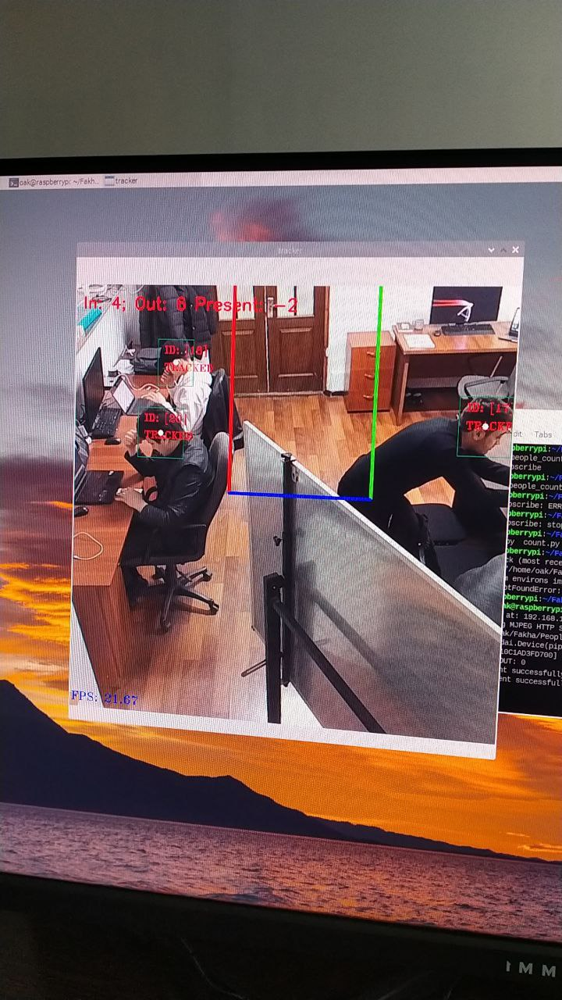

# Object Detection and Tracking with DepthAI and YOLOv6

This project is an implementation of object detection and tracking using a YOLOv6 model with DepthAI. It integrates a camera feed for real-time detection and tracking of objects and sends processed data to an external API.

Main reason for this project is to count people inside the building and track customers flow to a building. This is useful for buiseness which relies on customers number like Supermarket, mini markets, co-working spaces and others.

## Preview



## Features

- **Real-Time Object Detection**: Uses a YOLOv6 model trained for 100 epochs.
- **DepthAI Integration**: Utilizes DepthAI to manage camera input and feed processing.
- **Object Tracking**: Objects detected by the model are tracked using DepthAI's ObjectTracker.
- **API Integration**: Detected and tracked data is sent to an external API for further use.
- **Highly Configurable**: Parameters like line positions, camera orientation, and detection thresholds are customizable via a config file and environment variables.

## Requirements

- Python 3.7+
- DepthAI SDK
- OAK Camera (needs to support on-devices computing YOLO)
- OpenCV
- environs (for environment variables management)
- YOLOv6 model (pre-trained blob file in the `model` folder)

## Installation

1. **Clone this repository**:
   ```bash
   git clone <repository-url>
   cd <project-directory>
   ```

2. **Install dependencies**:

    ```bash
    pip install -r requirements.txt
    ```

3. **Set up the environment variables by creating a .env file in the root directory with the following entries**:

    ```bash
    MxID=<Device ID>
    API=<API Endpoint>
    ```

4. **Ensure the YOLOv6 model blob file is available in the model folder.**

## Usage

1. **Configure detection parameters in the config.py file. Update camera orientation, line positions, and more as required.**

2. **Run the main script**:

    ```bash
    python main.py
    ```
The camera feed will start, and detected objects will be tracked. Data will be sent to the configured API.

## Customization

- **Model**: You can replace the model file in the model directory with a different YOLO blob if needed.
- **API**: Modify send2api.py to customize the data sent to the external API.

## License
This project is licensed under the **MIT License**. See the LICENSE file for details.